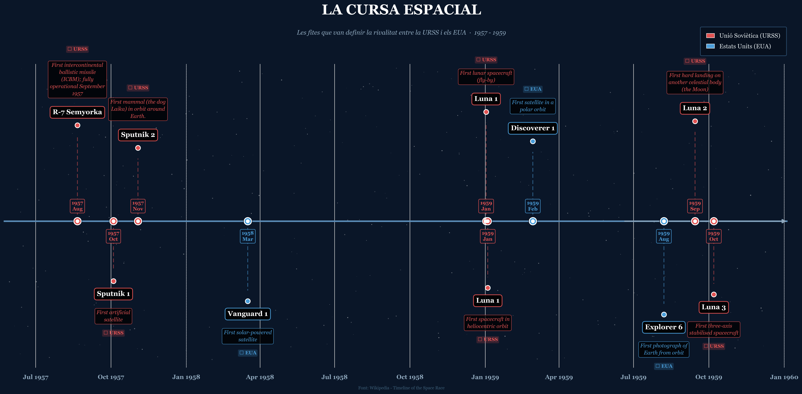
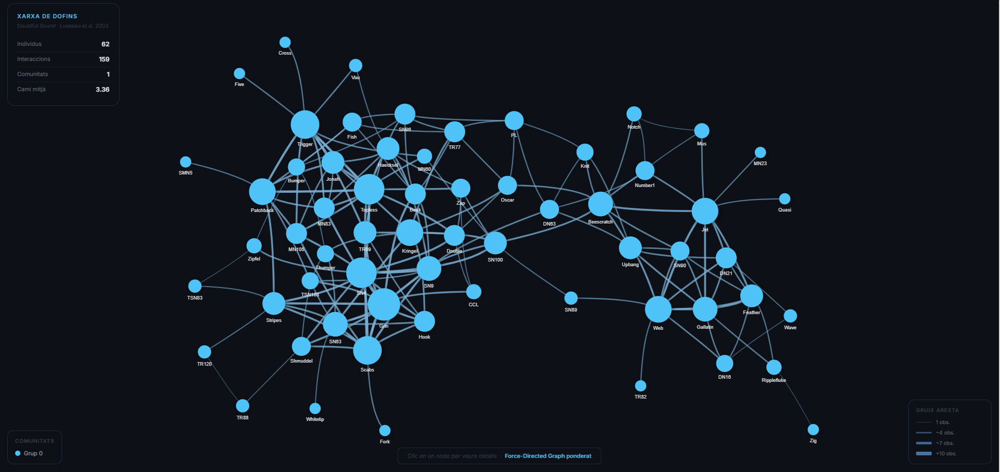
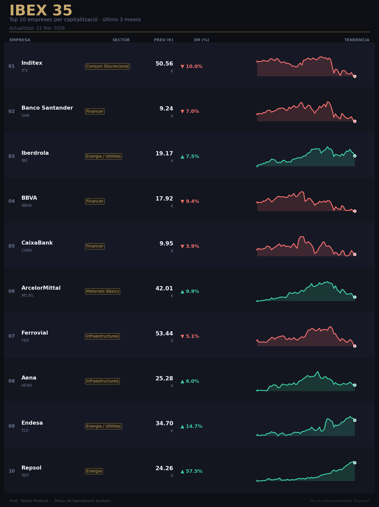

# DataScience-UOC---Visualitzaci-de-dades---PAC-2
Aquest repositori recull tres visualitzacions creades per avaluar l'adequació de diferents representacions gràfiques segons la naturalesa de les dades i l'objectiu comunicatiu.

## 1. Timeline: Cronologia (Cursa Espacial)

**Tècnica i Origen:** 

Es tracta d'una visualització que representa esdeveniments ordenats cronològicament al llarg d'un eix temporal. S'atribueix el seu origen a Joseph Priestley, qui va publicar el 1765 el *Chart of Biography*, considerat un dels primers timelines moderns.

**Avantatges:**
- Molt intuïtiva i fàcil d'interpretar
- Permet identificar patrons temporals i moments clau
- Ideal per explicar històries o evolucions

**Inconvenients:**
- Pot saturar-se amb massa esdeveniments
- Espai limitat si hi ha moltes anotacions
- No permet comparar múltiples variables complexes

**Tipus de dades admeses:** 

Aquest tipus de visualització requereix obligatòriament una dimensió temporal amb dades d'esdeveniments puntuals o intervals. Es pot complimentar amb dades qualitatives i quantitatives dels esdeveniments (descripció, durada, etc.) així com de variables categòriques per diferenciar actors o grups.

**Exemples i aplicacions:** 

S'utilitza habitualment en història i divulgació científica (fites d'una era, guerres, descobriments), en gestió de projectes per fer una planificació dels deadlines, en biografies o en cobertura periodística d'esdeveniments.

[Codi Font](Codi_Timeline.py)

**Dades utilitzades:** 

Les dades utilitzades provenen de la pàgina de Wikipedia ["Timeline of the Space Race"](https://en.wikipedia.org/wiki/Timeline_of_the_Space_Race), d'on s'ha extret la taula corresponent al període 1957-1959. De cada fila es conserven quatre camps: data, nació (normalitzada a URSS o EUA), fita (Achievement) i nom de la missió o vehicle (Mission/Vehicle).

**Anàlisi de la visualització:** 

La visualització mostra l'evolució inicial de la cursa espacial entre URSS i EUA, on s'ha utilitzat un codi de colors (vermell/blau) per facilitar la comparació entre països. Amb l'ajuda d'una disposició alternada dels esdeveniments s'identifiquen clarament els moments claus de la cursa espacial així com el ritme d'innovació entre les dues potències. Es destaca clarament un predomini de la URSS en aquest període amb una resposta progressiva dels EUA. L'objectiu comunicatiu és il·lustrar la rivalitat tecnològica i l'acceleració de la competició espacial durant aquests tres anys crítics, mostrant qui anava al davant en cada moment i quin era el ritme de les fites de cada potència.

---

## 2. Force-Directed Graph: Interaccions (Xarxa de Dofins)

**Tècnica i Origen:** 

El Force-Directed Graph és un tipus de xarxa basada en grafs on els nodes es posicionen automàticament mitjançant una simulació de forces físiques: les arestes actuen com a molles que atreuen els nodes connectats, mentre que tots els nodes es repel·leixen entre ells fins a trobar un equilibri. Els fonaments algorítmics van ser establerts per Peter Eades (1984) i posteriorment refinats per Fruchterman i Reingold (1991).

**Avantatges:**
- Permet visualitzar relacions i estructures complexes
- Identifica fàcilment comunitats o grups
- Destaca nodes importants (centrals)

**Inconvenients:**
- Amb xarxes grans el resultat es torna il·legible
- Resultats visuals poden variar (no és determinista)

**Tipus de dades admeses:** 

Aquest tipus de visualització necessita dades en forma de grafs: nodes (entitats) i arestes (relacions entre elles). Addicionalment pot incloure pesos per quantificar la intensitat de la relació i direccionalitat.

**Exemples i aplicacions:** 

S'utilitza habitualment en l'anàlisi de xarxes socials (qui es relaciona amb qui), en mapes de co-autoria científica, en xarxes d'interaccions biològiques (proteïnes, espècies), i en comportament animal.

[Codi Font](Codi_ForceDirected_Graph.py)

**Dades utilitzades:** 

Les dades provenen del conjunt utilitzat per la publicació "Doubtful Sound dolphin network" (Lusseau et al., 2003), extretes automàticament de la publicació de [Kaggle](https://www.kaggle.com/datasets/mashazhil/social-network-of-dolphins-in-new-zealand). Representen observacions d'associació entre 62 dofins individuals de la població de Doubtful Sound (Nova Zelanda), on cada aresta entre dos dofins indica que van ser observats junts amb una freqüència significativament superior a l'esperada per atzar. El codi carrega aquestes dades amb NetworkX.

**Anàlisi de la visualització:** 

La visualització mostra i representa una xarxa de 62 nodes (dofins) i 159 arestes (interaccions observades). Per a facilitar la lectura i detecció de nodes centrals apareixen com a cercles més grans i tendeixen a ocupar el centre del gràfic (per la pròpia naturalesa dels force-directed graph), juntament amb el gruix de les arestes que també augmenta segons el nombre d'interaccions. Tot i que només apreciem una comunitat, s'observen dos petits grups diferenciats. L'objectiu comunicatiu és revelar l'estructura social de la manada: qui són els individus clau i com de densa és la cohesió del grup, visualitzant la importància relativa de cada individu.

---

## 3. Sparklines: Evolució Borsa (Top 10 IBEX 35)

**Tècnica i Origen:** 

Les sparklines són mini gràfics de línia que mostren tendències de dades en espais molt reduïts, pensades per oferir informació ràpida sense necessitat d'eixos o etiquetes. El terme i el concepte van ser formalitzats per Edward Tufte al seu llibre *Beautiful Evidence* (2006).

**Avantatges:**
- Molt compactes, permeten comparar moltes sèries alhora
- Ideals per veure tendències ràpidament
- Fàcil integració en taules o dashboards

**Inconvenients:**
- Poc detall
- No aptes per dades complexes o molt llargues
- Han d'anar acompanyades de context

**Tipus de dades admeses:** 

Aquest tipus de visualització necessita sèries temporals numèriques amb un nombre moderat de punts. No són adequades per a sèries amb molts valors nuls o molt irregulars, ni per a dades categòriques o qualitatives, tot i que solen anar acompanyades d'altra informació en algun altre format.

**Exemples i aplicacions:** 

S'utilitzen habitualment en taulers borsaris (evolució de preus d'accions), en informes de negoci amb KPIs temporals, en taules de dades meteorològiques i, en general, en qualsevol tipus d'informe amb moltes mètriques resumides.

  

[Codi Font](Codi_Sparkline.py)

**Dades utilitzades:** 

Les dades provenen de [Yahoo Finance](https://es.finance.yahoo.com/), cobrint els últims tres mesos de cotització de les 10 companyies amb major capitalització de l'IBEX 35 fins a data d'execució. S'utilitzen els preus de tancament diaris i es calcula la variació percentual acumulada durant el període.

**Anàlisi de la visualització:** 

La visualització mostra una taula de 10 files, una per empresa, on cada fila combina el nom, el ticker, el sector, el preu actual en euros, la variació percentual en 3 mesos i una sparkline de tendència. S'utilitza un codi de colors per diferenciar variacions positives (verd) de negatives (vermell). A simple vista, detectem que destaca Repsol (+57.5%) en contrast a Inditex (-10.0%) o BBVA (-9.4%). L'objectiu comunicatiu és permetre una comparació ràpida del comportament borsari recent de totes les empreses en una sola vista compacta: les sparklines permeten identificar patrons i tendències de forma ràpida, facilitant la comparació entre companyies.
